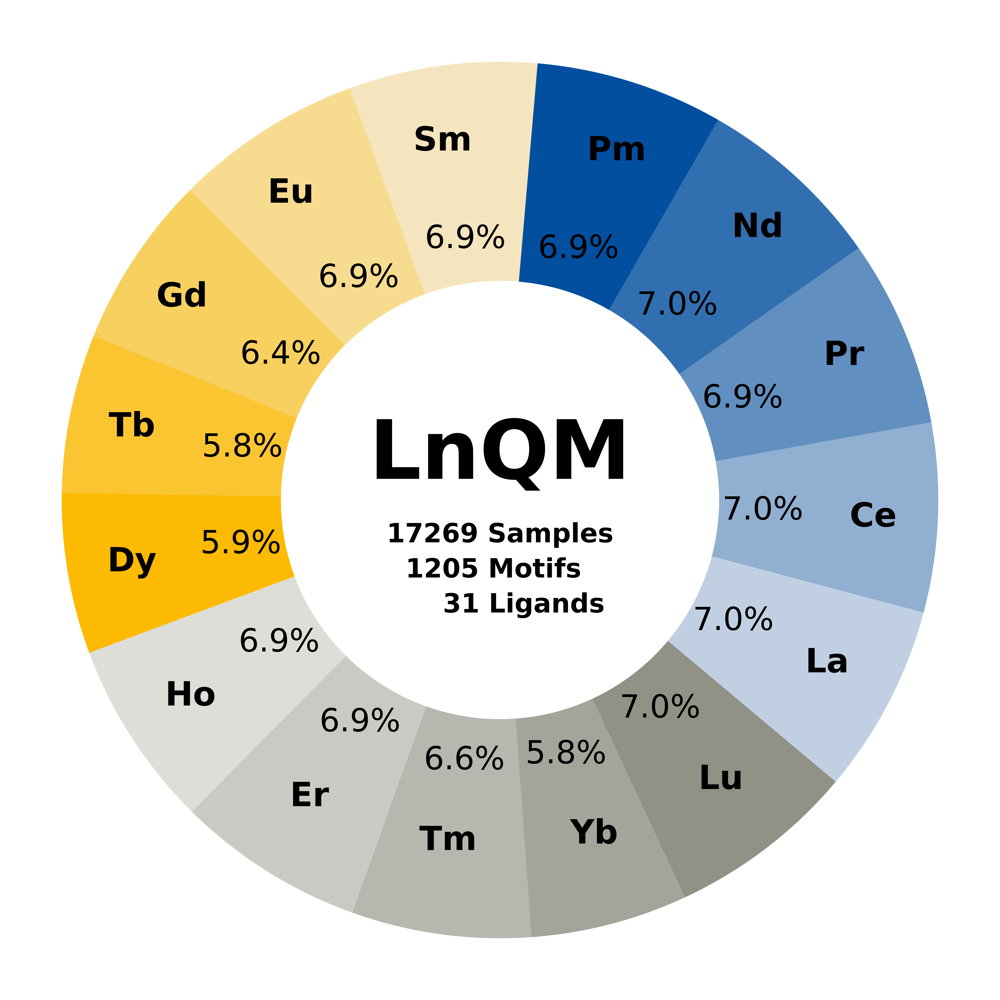

# LnQM dataset

[](https://www.python.org)
[](https://github.com/psf/black)

This is the offical repository of the `LnQM` dataset developed by the Grimme group in Bonn.

<div align="center">

</div>


# Data

The data is available under: [https://zenodo.org/records/10406124](https://zenodo.org/records/10406124)


# Setup

We provide a dataset class and a sample representation based on `pytorch`.
For this purpose please install the package requirements:
```bash
conda env create --file requirements.yml
```

Basic usage of the dataset:
```python
from lnqm import LnQM_Dataset

# load LnQM from disk
dataset = LnQM_Dataset(path_to_hdf5="/path/to/lnqm.h5")

# loop over each sample in the dataset
for data in dataset:
    # ...
    # do sth. with each sample
    # ...

    # e.g. access properties
    print(data.uid)
```

For a more detailed description of the features included see the datamodel in `LnQM_Sample`.
If required, a `Data` object can be converted via:

```python
from lnqm import LnQM_Sample
sample = LnQM_Sample(**data)
```

# Citations

When using or referencing to the `LnQM` please cite:
- C. Hölzer, I. Gordiy, S. Grimme, M. Bursch
  ... tbd ...

# License

[![CC BY NC 4.0][cc-by-nc-image]][cc-by-nc]

This work is licensed under a
[Creative Commons Attribution-NonCommercial 4.0 International License][cc-by-nc].

[cc-by-nc]: http://creativecommons.org/licenses/by-nc/4.0/
[cc-by-nc-image]: https://i.creativecommons.org/l/by-nc/4.0/88x31.png
